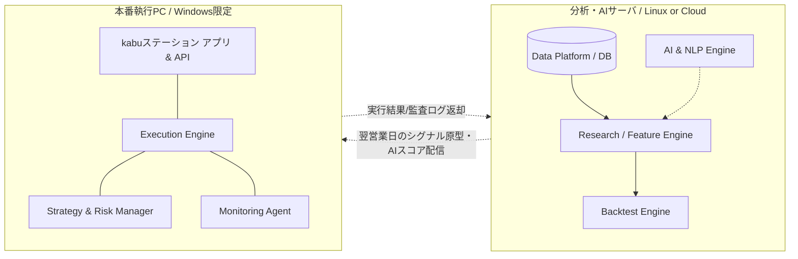

# System Architecture (システム全体構成)

- 対象: kabuステーション API と J-Quants Standard プランを用いた日本株自動売買基盤
- 版数: v1.0 (AI統合・6層アーキテクチャ版)

---

## 1. システム化の背景と目的

本システムは、三菱UFJ eスマート証券の **kabuステーション API** を利用し、データ駆動（Data-Driven）アプローチによる日本株の自動売買環境を構築する。単なる発注の自動化ではなく、以下の実現を目的とする。

- スクリーニングによる客観的な売買候補銘柄抽出
- 財務・テクニカル指標とAIニュース分析・AIレジーム判定を統合した売買判断
- バックテストと本番環境の完全な一致（再現性の担保）
- 本番実行環境での堅牢なシステム保護と誤発注の防止

---

## 2. アーキテクチャ全体像（6層構造）

本システムは実務クオンツファンドの構造を踏襲し、データソースから発注までの責務を厳格に分離した「6層アーキテクチャ」を採用する。AIは直接発注を行わず、補助シグナルとして活用することでフェイルセーフを担保する。

### 2.1 レイヤー間データフロー

```text
             Monitoring (監視・運用統制層)
                 ↑
Execution ← Strategy ← Research (分析層)
  (執行層)    (戦略層)      ↑
                   Data (データ・インフラ層)
```
※ AI Model (市場インテリジェンス層) は Data と Strategy の間に位置し、非定型情報（テキスト・マクロ指標など）をスコア化して Strategy に供給する。

### 2.2 各レイヤーの責務と構成

1. **01_Data (Data Layer)**
   - J-Quants（市場データ・財務データ）やニュースソースからのデータ収集・クレンジング・正規化と一元保存。
2. **Research (Research Layer ※Backtestに包含)**
   - 特徴量（モメンタム、バリュー等）の生成、銘柄スクリーニング。
3. **02_Strategy (Strategy Layer)**
   - 財務・テクニカルスコアとAIスコアの統合（シグナル生成）。
   - ポジションサイジングとリスクアサイン。
4. **03_AI_Model (AI Analysis Layer)**
   - ニュースのNLPセンチメント分析、マクロイベント検知、市場レジーム判定（Bull/Neutral/Bear）。
5. **04_Execution (Execution Layer)**
   - kabuステーション APIを通じたREST発注・WebSocket状態監視。発注キューと状態管理（OrderStateMachine）。
6. **Monitoring (Monitoring Layer ※Execution等から呼出)**
   - ログ保存、稼働監視（ヘルスチェック）、異常時のアラート通知（Slack等）。手動キルスイッチ。

---

## 3. 物理・論理配置の分離原則

「データの確定と分析にかかる重い処理プロセス」と、「リアルタイムな証券APIとの通信・発注プロセス」を物理・論理的に分離し、本番でのフリーズや注文遅延事故を防ぐ。



### 3.1 構成の意図
- **PC2 (Linux/Cloud)**: ETLバッチ処理やNLP推論など、リソースを大量消費するタスクを担う。Windowsである必要がない。
- **PC1 (Windows)**: kabuステーションアプリの稼働が必須の執行ノード。発注と監視に専念し、分析負荷を排除する。

---

## 4. 段階的導入計画 (Phase)

- **Phase 1: PoC（データ基盤と検証基盤）**
  - J-Quants 取込（Data層）、基本特徴量スクリーニング、単純バックテストの確立。
- **Phase 2: ルールベース本番接続 (Execution)**
  - 執行層・リスク層の構築と、AIなし（モメンタム・バリュー）でのkabuステーション少額実売買。
- **Phase 3: AIモデル統合 (AI Integration)**
  - ニュースデータ収集、NLPモデル・レジーム判定の実装とシグナル統合。
- **Phase 4: 完全自動化と監視高度化 (Ops/Advanced)**
  - 完全自動発注、Grafana等によるメトリクス監視、セクター別複数戦略の並列運用。
