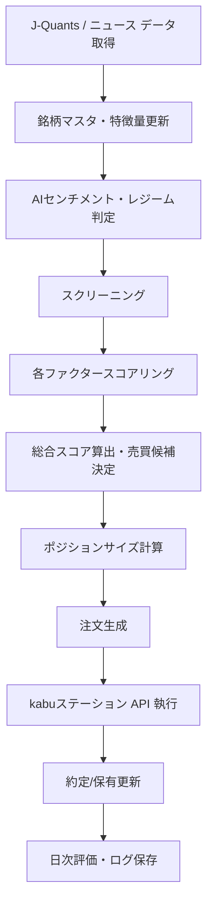

# 売買戦略仕様（AI統合完全版）

## 1. 目的

本ドキュメントは、**J-Quants Standard** データおよびニュースセンチメント分析によるスクリーニング・バックテスト基盤と、**kabuステーション API** を用いた本番執行基盤を前提として、日本株自動売買システムにおける売買戦略の仕様を定義するものである。

本戦略は以下の思想に基づく。
- データドリブンな投資判断
- 複数ファクターの統合スコアリング
- AIによる市場環境（レジーム）判定
- ニュース・マクロ情報の補助的利用

本仕様の目的は、戦略ロジックを曖昧さなく定義し、研究から本番までを一貫させつつ、システム実装に必要なリスク管理・発注制御の制約を明文化することである。

---

## 2. 適用範囲

本仕様は、以下の機能に適用する。

- ユニバース生成・銘柄スクリーニング
- 特徴量抽出・AI感情分析
- 総合スコアリングと売買シグナル生成
- レジーム判定によるポジション・リスク制御
- ポジションサイズ計算
- エントリー／イグジット条件・執行タイミング
- バックテスト評価ルールおよび日次・場中運用ルール

対象市場は原則として**東証上場の現物株**とする。

---

## 3. 戦略思想と設計方針

### 3.1 複合ファクターモデル
本システムでは単一指標による売買ではなく、以下の複合ファクターモデルを採用する。

1. モメンタム
2. バリュー
3. ボラティリティ
4. 流動性
5. ニュースセンチメント
6. 市場レジーム

これらをスコア化し、統合スコアを算出してシグナルとする。

### 3.2 段階導入方針
初期段階から複雑すぎるAIモデルをブラックボックスとして運用しないため、以下を段階的に取り入れる。
1. **ルールベース・スコアリング戦略（ベースライン）**: 財務、価格特徴量に基づく静的スコア
2. **AIレジーム・センチメント統合（本戦略）**: NLPによるニューススコアと、AIレジーム判定をスコア統合
3. **完全な機械学習予測（将来）**: AIによる上昇確率の直接推論

---

## 4. 全体フロー



---

## 5. 銘柄ユニバース

### 5.1 母集団と対象市場
- 東証プライム
- 東証スタンダード
※ ETF、REIT、優先出資証券、外国株、整理銘柄、グロース市場は初期対象外とする。

### 5.2 フィルタ条件（除外・推奨条件）
以下に該当する銘柄は対象外とし、条件を満たすものをユニバースとする。
- 監理銘柄、整理銘柄、取引停止中の銘柄を除外
- 株価（最低株価）：300円以上
- 20日平均売買代金：5億円以上
- 上場期間：250営業日（約1年）以上
- データ完整性：欠損率が閾値以下であること

---

## 6. データ仕様と参照ルール

### 6.1 使用データソース
- 市場データ: J-Quants Daily Quotes, Listed Info, Financial Statements
- ニュースデータ: Yahoo News, 日経ヴェリタス 等 (NLPセンチメント抽出用)

### 6.2 ルックアヘッド（未来情報参照）防止ルール【超重要】
バックテストと本番の乖離を防ぐため、以下を必須ルールとする。
- 当日未確定データを当日シグナル（翌日寄付発注向け）に使わない。
- 財務発表日の利用可能時刻を厳格に定義する。（引け後発表は翌営業日引け後のデータとして扱う等）
- 分割・併合補正はデータ確定後にのみ適用する。

---

## 7. 特徴量設計とスコアリング（Feature Engineering）

各ファクターをスコア化（正規化・Zスコア化等）する。

### 7.1 モメンタム
- 計算指標：1ヶ月、3ヶ月、6ヶ月リターン、価格/200日移動平均乖離率
- スコア：`score_momentum = normalize(w1 * return_1m + w2 * return_3m + w3 * return_6m)`

### 7.2 バリュー
- 計算指標：PER、PBR、配当利回り、EV/EBITDA
- スコア：`score_value = inverse_rank(PER, PBR)` （割安なほど高スコア）

### 7.3 ボラティリティ
- 計算指標：20日標準偏差、ATR、ボラティリティ変化率
- スコア：`score_volatility = normalize(volatility)`

### 7.4 流動性
- 計算指標：売買代金、出来高変化率
- スコア：`score_liquidity = normalize(turnover)`

---

## 8. ニュースセンチメント分析

ニュース記事を自然言語処理（AI）により解析し以下を抽出する。
- ポジティブ / ネガティブ / 中立
- センチメントスコア：`score_news = sentiment_score`
- 総合スコアにおけるセンチメントの影響度は最大10%〜20%に制限する。（過大評価防止）

---

## 9. 市場レジーム判定

市場状態を以下の3状態にAI（またはマクロ指標）で分類する。
- **1. Bull（上昇トレンド）**：モメンタム重視、積極エントリー
- **2. Neutral（レンジ）**：新規建てを半分に抑制
- **3. Bear（下落トレンド）**：新規建て停止、ポジション縮小のみ（Risk OFF）

判定指標例：
- TOPIX 200日移動平均と25日線推移
- VIX、市場全体のボラティリティ
- 東証全体の売買代金動向

---

## 10. 総合スコアリング

各ファクターを統合し最終期待値スコアを算出する。
（ウェイトは初期パラメータ案であり、バックテストで最適化する）

```text
final_score = 
    0.40 * score_momentum +
    0.20 * score_value +
    0.15 * score_volatility +
    0.15 * score_liquidity +
    0.10 * score_news
```

---

## 11. エントリー・イグジット条件

### 11.1 エントリー条件
- `final_score > threshold` （閾値以上のスコア）
- 出来高が直近平均より増加傾向にあること
- 市場レジームが Bull または Neutral であること（Bear時は新規見送り）
- 上位スコア銘柄から順に採用し、同時保有上限まで組み入れる。

### 11.2 エントリータイミング
- 原則、**翌営業日の寄付き成行** または **寄付き指値レンジ内**。
- 寄付き未約定時、当日中の追いかけ発注（急騰への飛び乗り）は原則行わない。特別気配・寄らず時は見送り。

### 11.3 イグジット（手仕舞い）条件
以下のいずれかを満たした場合に翌営業日寄付きで売却する。
- **スコア低下**: `final_score` が下位閾値を下回る。
- **損切り（損切り幅固定・ATR連動）**: 建値比 -8%（またはATRのN倍）到達時。
- **利確・保護**: 高値からのトレーリングストップ -10% 到達時。
- **時間決済**: 最大保有日数（例: 60営業日）を超過した場合。
- **イベント回避**: 決算発表直前や、流動性の急激な枯渇が確認された場合。

---

## 12. ポジション・資金管理仕様

### 12.1 基本ルール
- 総投下資金上限：総資産の70%まで
- 1銘柄最大比率（上限）：総資産の10%
- 最大保有銘柄数：10銘柄
- 同一セクター上限：30%以内に制限し、集中リスクを避ける
- 1売買の許容損失：総資産の0.5〜1.0%

### 12.2 発注数量（株数）計算
銘柄ごとのリスク量を揃えるため、許容損失から逆算して株数を決定する。
```text
許容損失額 = 総資産 × 0.005 (0.5%)
1株あたりリスク = エントリー価格 - 損切り許容価格（例: 8%下落位置）
株数 = floor(許容損失額 / 1株あたりリスク)
```
※最終的な株数は、実際の売買単位（100株等）に丸め、上限である総資産の10%を超えないようにクリップする。

---

## 13. リスク管理仕様

### 13.1 戦略レベルの制御
- **最大ドローダウン制御**: 日次 -2%、週次 -5% 等の基準で新規発注を停止。
- **連敗停止条件**: 一定数（例：5連敗）で翌日の新規建て停止。

### 13.2 システム保護レベル
- APIエラー多発時（連続N回など）は安全のため新規発注停止。
- PC/サーバーの時刻同期異常時や、kabuステーション未接続時は執行不可状態とする。
- 保有情報が証券口座側とローカルDBで不整合を起こした場合、手動確認モードへ遷移し自律売買を止める。

---

## 14. バックテスト仕様

システム実装と同等の条件で再現検証を行うため、以下を必須とする。

### 14.1 検証前提条件
- **約定ルール**: シグナル発生日の翌営業日寄付きで約定させる。
- **コスト反映**: 売買手数料（実運用同等）とスリッページ（固定bpsまたは流動性依存）、必要に応じて税コストを反映。
- **検証期間**: 最低5年以上（上昇・下落・レンジ相場をすべて含む期間を確保）。

### 14.2 評価指標
- CAGR（年率リターン）、Sharpe Ratio、Sortino Ratio
- Max Drawdown（最大ドローダウン）
- Win Rate（勝率）、Profit Factor
- Turnover（回転率）、Average Holding Days（平均保有日数）

ウォークフォワード検証や、売買代金フィルタ・スリッページ悪化に対する感度分析を必須とする。

---

## 15. 本番運用・監査仕様

### 15.1 日次運用フロー
1. **引け後 (16:00~)**: J-Quantsデータ・ニュース取得、特徴量算出、AIスコアリング。
2. **前日夜間〜当日早朝**: スクリーニング、シグナル生成、翌営業日の注文対象リスト確定・保存。
3. **寄付き前 (08:30~)**: API接続、競合確認、発注数量の最終計算と発注実行。
4. **場中**: 約定確認、緊急停止条件の監視。
5. **引け後**: 取引ログ保存、パフォーマンス更新。

### 15.2 ログ・監査方針
なぜ買い・売り判断を下したかを追跡可能にする。
- シグナル生成時の各ファクタースコア、センチメント判定結果の保存。
- 注文内容、約定結果、エラー・キャンセル履歴の保存。

---

## 16. 初期パラメータ案まとめ

| 分類 | 項目 | 初期値案 |
|---|---|---|
| ユニバース | 最低株価 / 売買代金 | 300円 / 5億円 |
| ボリューム | 最大保有数 / 1銘柄上限 | 10銘柄 / 資産の10% |
| セクター | 同一セクター上限 | 30% |
| シグナル | 総合スコア閾値 | バックテストで決定 |
| 手仕舞い | 損切り / トレーリング | -8% / -10% |
| 手仕舞い | 最大保有期間 | 60営業日 |
| リスク | 1回許容損失 / 総上限 | 0.5% / 資産の70% |

---

## 17. 未決事項（今後の設計確定事項）
1. 寄付き成行と寄付き指値のどちらを標準とするか
2. スリッページ推定方法（固定bps vs 流動性依存ベース）
3. J-Quantsからのデータ取得連携のバッチ時刻（ニュースAPIの取得タイミング）
4. 緊急停止後の自動復帰フロー（手動再開のみとするか）

## 18. 推奨次ドキュメント
本仕様を元に、実装に向けて以下の設計を行う。
- `データモデル設計.md`
- `バックテスト設計.md`
- `発注・約定制御仕様.md`
- `リスク管理仕様.md`
